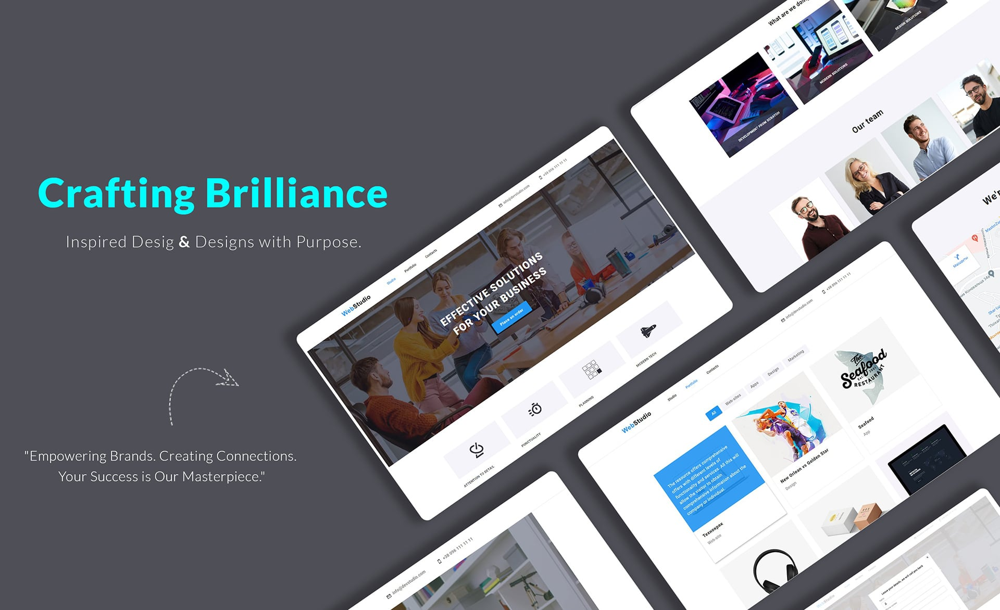
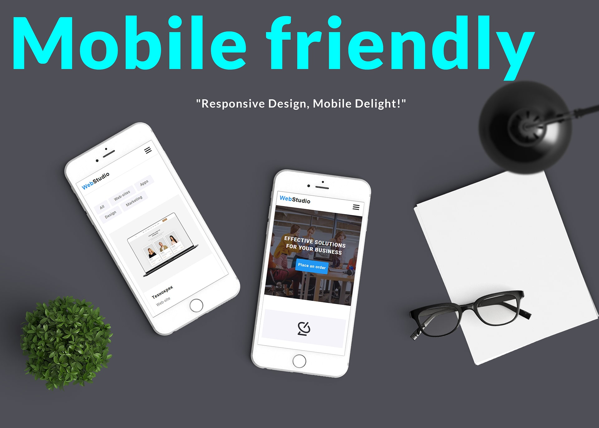
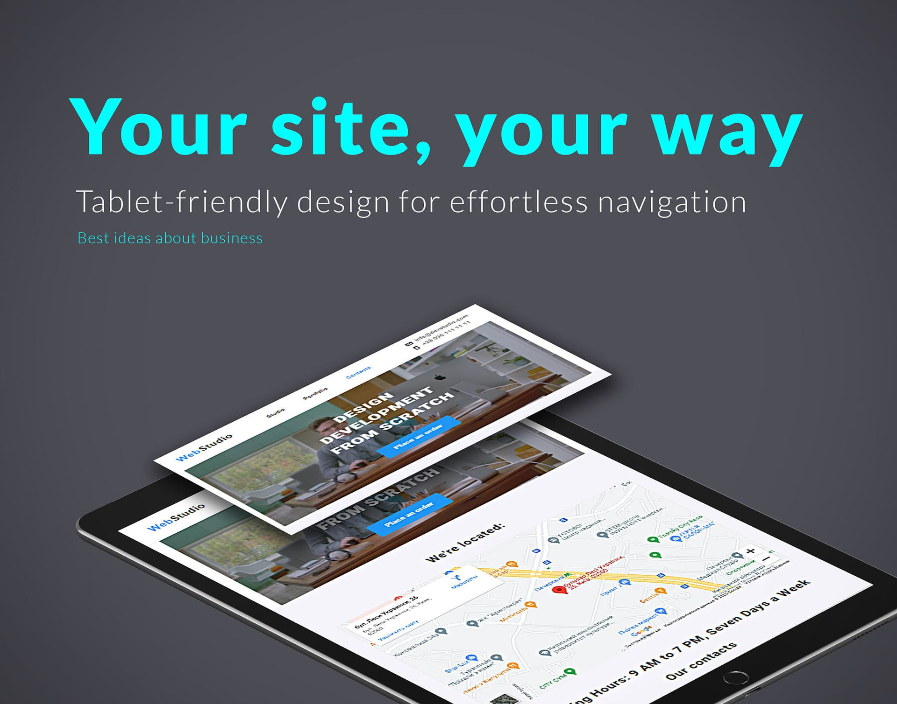

# WebStudio Website

**Built using HTML5, JS, Lodash & Notiflix, Handlebars**.

This is a WebStudio website created as training project to practice JavaScript, DOM manipulation,
Sass, and working with various libraries like Lodash, Notiflix...

## Demo

Check out the live demo of the website:
[WebStudio Website Demo](https://solod-s.github.io/Solod-S-goit-markup-hw-08/)

## Responsive Design and semantic layout

The website is developed using responsive design principles to ensure a seamless user experience
across various devices, including desktops, tablets, and mobile phones.

Website using semantic elements, it becomes easier for search engines to understand and index the
website's content, leading to improved search engine optimization (SEO) and better accessibility for
users of assistive technologies.

Overall, combining responsive design with semantic layout enhances the user experience by ensuring
the website is visually appealing, adaptable to different screen sizes, and structured in a way that
is easy to navigate and understand.

## Features

- Menu: Browse through our delicious menu offerings
- Order: Make an order
- Location: Find our WebStudio's address
- Contact: Get in touch with us through the provided contact information

## Technologies Used

    HTML
    CSS
    JavaScript
    Sass
    Handlebars
    Lodash

## Getting Started

To get a local copy of the project up and running, follow these steps:

1. Clone the repository: `git clone https://github.com/solod-s/Solod-S-goit-markup-hw-08.git`
2. Navigate to the project directory: `cd Solod-S-goit-markup-hw-08`
3. Open the `index.html` file in your web browser

## Contributing

Contributions are welcome! If you have any suggestions or improvements, please create a pull
request. For major changes, please open an issue first to discuss the changes.

**_NOTE: PLEASE LET ME KNOW IF YOU DISCOVERED ANY BUG OR YOU HAVE ANY SUGGESTIONS_**
